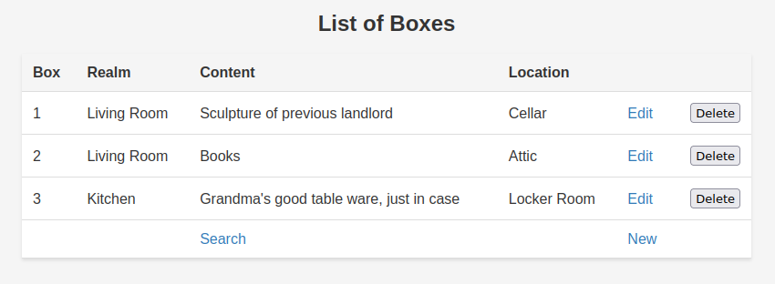

# Abstract

Welcome to __boxbrainiac__, a convenient solution to manage the content of your
carton boxes eliminating the need to remember what's inside each box. This
document provides an overview of its features, installation process, and
additional information.


# Introduction

__Boxbrainiac__ is a straightforward application designed to manage the
contents of your carton boxes. With a simple web GUI and data storage in YAML,
it aims to make content management a breeze. It incorporates a git layer to
handle automatic pull, push, commit, and add commands when the YAML database
file is placed into a git repository. Please note that the git layer is
primarily designed for individual use and will not handle merge conflicts for
team use. The application has been tested and is compatible with Debian 9
Stretch and Debian 11 Bullseye.



# Installation

## Dependencies

__Boxbrainiac__ is dependent on Python version 3.5 or higher.

For Debian users, you can install the dependencies with the following command:

```bash
aptitude install python3-git python3-levenshtein python3-fuzzywuzzy \
python3-yaml python3-flask
```

# Usage & Examples

`boxbrainiac` is a command-line application with a variety of options to
customize its usage. Below are detailed examples provided of how to use each of
these options.

## Basic Usage

At its most basic, you can run `boxbrainiac` with no arguments:

```bash
boxbrainiac
```

This will start the application with default settings and print a URL. You can
point your browser to this URL and start using `boxbrainiac`.

## Print the Program Version

To check the version of the application, use the `--version` flag:

```bash
boxbrainiac --version
```

This command will return the current version of `boxbrainiac`.

## Customizing the Host and Port

By default, `boxbrainiac` will use the host and port specified in its
configuration. You can override this by using the `--host` and `--port`
options:

```bash
boxbrainiac --host 127.0.0.1 --port 8080
```

This command will start `boxbrainiac` on the IPv4 `localhost` address using
port 8080.

## Controlling Output Verbosity

`boxbrainiac` provides several options to control the verbosity of its output:

- To suppress all output in the terminal, use the `--quiet` option:

  ```bash
  boxbrainiac --quiet
  ```

- To print only the host and port to connect to, use the `--verbose` option:

  ```bash
  boxbrainiac --verbose
  ```

- For detailed output including many debug messages, use the `--debug` option:

  ```bash
  boxbrainiac --debug
  ```

## Specifying the Database Location

`boxbrainiac` allows you to specify the location of the database it should use.
This can be done using the `--repo_dir` or `--yaml_file` options:

- To use a specific directory for the database, use the `--repo_dir` option.
For example, the following command will use
`$HOME/my-boxbrainiac/data/boxbrainiac.yaml` as the database:

  ```bash
  mkdir -p $HOME/my-boxbrainiac/data
  boxbrainiac --repo_dir=$HOME/my-boxbrainiac/data
  ```

- To use a specific file for the database, use the `--yaml_file` option. For
example, the following command will use `$HOME/.boxbrainiac/data/cellar.yaml`
as the database:

  ```bash
  boxbrainiac --yaml_file=cellar.yaml
  ```

Remember to replace `127.0.0.1`, `8080`, `$HOME/my-boxbrainiac`, and
`cellar.yaml` with your actual host, port, directory path, and file name,
respectively.

With these options, you can customize `boxbrainiac` to suit your specific
needs. Happy organizing!

# Testing

## Test Dependencies for Python3

Three different approaches are provided for installing the test dependencies:

1. **Debian package manager**: Suitable if you want to use the application
   globally.
2. **Python3 globally**: Alternative to Debian package manager.
3. **Python3 locally inside a virtual environment**: Ideal for testing the
   application.

Here are the steps for each approach:

__Debian Way:__

```bash
aptitude install python3-html5lib python3-lxml python3-flask python3-mock
```

__Python Way:__

```bash
pip3 install html5lib lxml flask python-mock
```

__Virtual Environment:__

Follow the steps below to create a virtual environment, install test
dependencies, and run the test:

```bash
# Step 1: Create a virtual environment
cd /tmp # If not done
python3 -m venv venv # If not done
cd venv # If not done
source bin/activate # If not done
cd /tmp # If not done
git clone https://github.com/ckuelker/boxbrainiac # If not done

# Step 2: Install test dependencies locally inside the virtual environment
cd boxbrainiac
# For bash
pip install .[test]
# For zsh
pip install .\[test\]

# Step 3: Run the test
python3 -m unittest tests/test_*.py
```

# Build

## Dependencies

```bash
aptitude install python3-setuptools python3-wheel
```

## Building

To build the project, follow the steps below:

```bash
cd /tmp # if not done
python3 -m venv venv # If not done
cd venv # If not done
source bin/activate # If not done
cd /tmp/boxbrainiac
python3 setup.py sdist bdist_wheel
```

In case the global wheel is not accepted, install it inside the virtual
environment:

```bash
pip install wheel
```

# Install From Build

To install from the build, follow the steps below:

```bash
cd /tmp # if not done
python3 -m venv venv # If not done
cd venv # If not done
source bin/activate # If not done
cd /tmp/boxbrainiac
pip install dist/boxbrainiac-0.1.0.tar.gz # 1st method OR
pip install dist/boxbrainiac-0.1.0-py3-none-any.whl # 2nd method
```

This will install it inside the virtual environment. It can also be installed
globally if required.

# Debugging Git

For a fast git debug `boxbrainiac` can be run from the repository like so

```bash
export PYTHONPATH=/path/to/git-repository/boxbrainiac
export BIN=$PYTHONPATH/boxbrainiac/main.py
export DATA=/path/to/data-repository

python3 $BIN --repo_dir=$DATA -d
```

# Contribution

Contributions to `boxbrainiac` are both welcomed and appreciated. Here's how
you can contribute to the project:

## Before You Start

Before making a contribution, it is strongly recommended that you first discuss
the change you wish to make via a new issue, email, or any other method with
the owners of this repository.

If you're unsure about anything, feel free to reach out by writing an email.
Assistance is readily available to support the contribution process.

## Making a Pull Request

If you're ready to make a contribution, the standard process is to make a pull
request. Here are the general steps to follow:

1. **Fork the Repository:** Start by forking the `boxbrainiac` repository.

2. **Create a Branch:** Create a new branch on your forked repository. It's
best practice to create a new branch for each new feature or bug fix.

3. **Make Your Changes:** Make your changes to the code. Ensure that your code
follows our coding standards and conventions.

4. **Commit Your Changes:** Commit your changes to your branch. Write clear,
comprehensive commit messages - this helps to understand the purpose of your
changes.

5. **Push to Your Branch:** Push your committed changes to your branch on your
forked repository.

6. **Submit a Pull Request:** From your forked repository, submit a pull
request to the `boxbrainiac` repository. Provide a comprehensive description of
the changes you've made.

## What's Next?

After you've submitted a pull request, the maintainer of the `boxbrainiac`
project will review your contribution. He may ask for some changes or
improvements. Please be patient - this is a normal part of the review process,
and helps to maintain the quality of the codebase.

The time and effort invested in contributing to `boxbrainiac` are highly
valued.  Thank you for contributing to `boxbrainiac` and making this project
better!

# History

| Version | Date       | Notes                                                |
| ------- | ---------- | ---------------------------------------------------- |
| 0.1.2   | 2023-06-26 | Change from Dulwich (git) to GitPython               |
| 0.1.1   | 2023-05-24 | Minor GUI improvements (ID -> Box)                   |
| 0.1.0   | 2023-05-16 | Initial release                                      |


## 0.1.2 Change git storage layer

- Change from Dulwich (git) to _GitPython_
- Rename `git.py` to `vcs.py` (name conflict with _GitPython_)
- Adapt `vcs.py` to use _GitPython_
- Update `vcs.py` tests
- Create git directories, if needed for new projects
- The configuration includes now `yaml_path` from the start (cosmetic change)
- Changed this `README.md`
  - Remove bogus bracket
  - Add detailed changes sub-sections
  - Change dependency from `python3-dulwich` to `python3-git`
  - Add more inline verbatim
  - Add section about debugging git from this repository

## 0.1.1 Minor GUI Improvements

- The __ID__ field was renamed to __Box__ in the GUI (to reflect the object)

## 0.1.0 Initial release

- Release to github.com/ckuelker

# Author

    Christian Külker <c@c8i.org>

# License And Copyright

    Copyright (C) 2023 by Christian Kuelker

    This program is free software; you can redistribute it and/or modify it
    under the terms of the GNU General Public License as published by the Free
    Software Foundation; either version 3, or (at your option) any later
    version.

    This program is distributed in the hope that it will be useful, but WITHOUT
    ANY WARRANTY; without even the implied warranty of MERCHANTABILITY or
    FITNESS FOR A PARTICULAR PURPOSE.  See the GNU General Public License for
    more details.

    You should have received a copy of the GNU General Public License along
    with this program; if not, write to the Free Software Foundation, Inc., 59
    Temple Place, Suite 330, Boston, MA 02111-1307 USA

